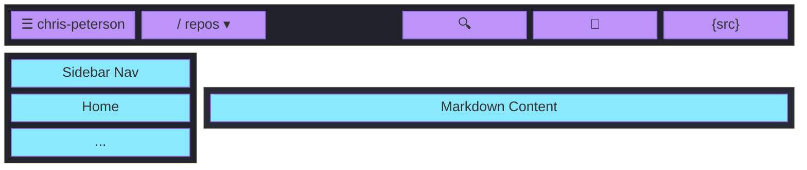

# chris-peterson.github.io

Hub site for Chris Peterson's open source project documentation.

https://chris-peterson.github.io | [source](https://github.com/chris-peterson/chris-peterson.github.io)

## Site Layout



🟪 Hub repo (this repo) · 🟦 Hosted repo (project-specific content)

The site is a [Docsify](https://docsify.js.org/) SPA using Dracula/Alucard theming with a day/night toggle. The `docs/` directory is deployed to GitHub Pages via GitHub Actions — no build step required.

**Hub pattern** -- this site serves shared assets (theme CSS, titlebar, docsify-shared.js) that project sub-sites consume. The `projects.yml` manifest drives the breadcrumb repo selector across all sites.

## Local Testing

```bash
docsify serve docs
```
