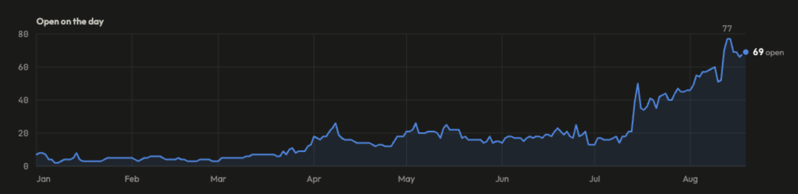

# Too Much

For the last few months I've had a feeling that I'm "collecting work"
as opposed to delivering.

I pulled some metrics, and my feelings are validated.

Historically, I maintain 0-10 WIP (work in progress) items at a time.

In April, the water level rose to ~20 and while this didn't slow my delivery rate, I could start to feel the mental drag.

In mid-July it stepped again, from ~15 to ~50 in a day; ever since I've been spiraling,
peaking at 77 and sitting at 69 open today.

Each day, I try to reduce by 1; or at the very least hold the line.  Inevitably, my WIP counter goes up instead.

When I say _every day_, I mean weekends too.
I'll start a hopeful morning coffee shop session
> It'll feel good to get a couple things knocked out, or at least plan how to deliver them this week

It never works; time to change approach.

## What's Happening?

One of the things consuming a lot of my mental bandwidth is [`bridge.ai`](https://chris-peterson.github.io/claude-marketplace/#/), a collection of Claude Code plugins that I created.

It covers the full software development cycle and is involved in pretty much every task that I undertake.
What ends up happening is I pull a backlog item, start working on it; get annoyed/frustrated with the tooling, and pivot to diagnosing/fixing.

The rate of change in this space is incredibly fast; Claude Code releasing a few times a day, and not having a great
track record WRT not breaking things, communicating changes, etc.
As such, things are always breaking, and requiring fixing.

## What Can I Do?

**Less.**

Today, I'm letting go of a few initiatives

### Window Management
In my early days of adopting AI, I would end up with dozens of open terminals and struggle to keep track of them all, where they were (by location), as well as what state they were in (e.g. agent busy, or waiting for me to answer a question, etc).  Since then, I've adjusted my behavior; instead utilizing iTerm tabs and [`beacon`](https://chris-peterson.github.io/beacon/#/)

As such, I'm no longer pursuing a [mission control replacement](https://tomeraviv.github.io/FastMissionControl) 

### Alternate Terminals
I had been trying out various terminal experiences including:
* [herdr](https://herdr.dev)
* [agterm](https://agterm.com)
* [iTerm2](https://github.com/gnachman/iTerm2)

At one point, I was preparing upstream contributions to iTerm2; but ended up working with the existing featureset.  Letting these go.

### Custom Diff Tool

Back in early 2026, I wanted a diff tool made for AI-assisted workflows.  I couldn't find one that placed the _human_ as the reviewer and offered an easy way to provide _in-context feedback / change requests_.

So, I built [`moor`](https://chris-peterson.github.io/moor/#/).  Since then, some other OSS has materialized, and I've switched to using [revdiff](https://revdiff.com).  I like it better as it attaches directly to the originating terminal; no more disconnected windows to manage.

Moving `moor` into maintenance mode.

### Retrospective Tool

A key part of any successful AI-assisted workflow is to capture and incorporate learnings as feedback to the harness.

Thoughtworks' Birgitta Böckeler calls this [the steering loop](https://martinfowler.com/articles/harness-engineering.html): when an issue shows up more than once, you fix the harness rather than the output.

[`logbook`](https://chris-peterson.github.io/logbook/#/) offers some utilities for capturing mid-session notes for later review.
It also has features for teams to store retros in a central location.

In practice, learnings generally end up being most useful to specific individuals; so a local store is sufficient.  And when a learning does
repeat, plugins / skill repositories
end up being more efficient vehicles for
team/cross-team sharing.

Letting this one go too.

## Summary

By letting go of a handful of items; I can already feel lighter.

This is the first of many reductions to get back to a reasonable way of working.

Stay tuned.
